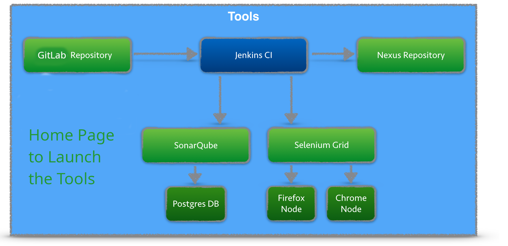
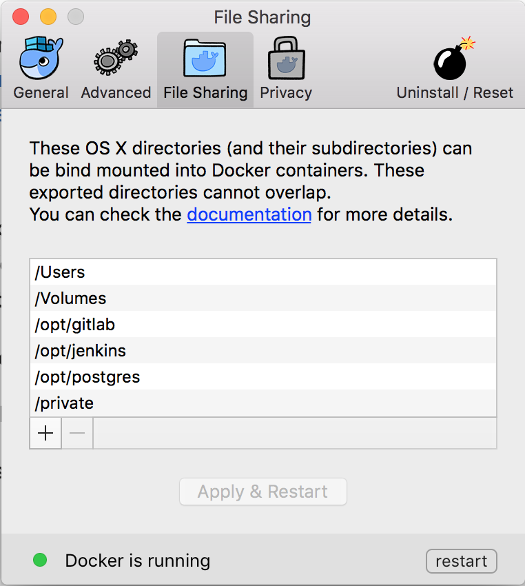
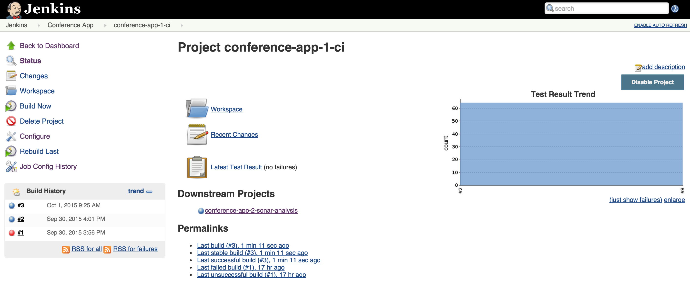
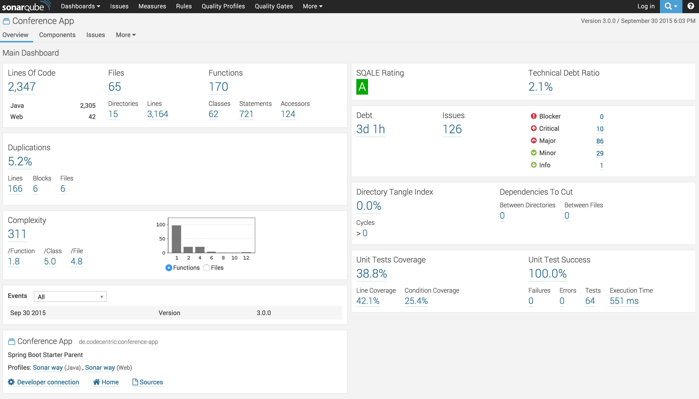
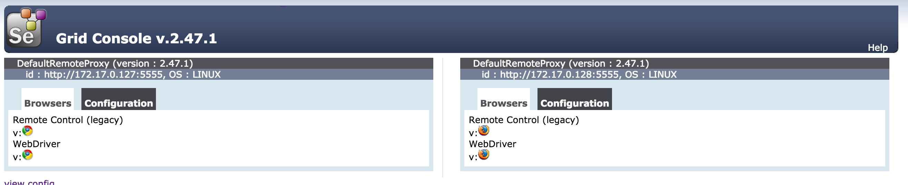

# Docker based Continuous Integration Containers

## Pre-Requisites

- Docker (for Mac OSX / Windows / Docker)
- Docker Compose
- ***Clone the repository and checkout branch Feature_00_Jenkins***

## QuickStart

- To Start containers in the background

    ```bash
    #!/bin/bash
     $ docker-compose up -d
    ```

- Stoping all containers

    ```bash
    #!/bin/bash
    $ docker-compose down
    ```

## The result of the compose is multi-fold

- Build Jenkins with Java8,Maven 3, Nginx Images
- Build Nexus version 2.14.18-01 and configure with a jboss repo
- Build Sonar version 7.0 and configure various sonar plugins
- Start the respective containers with port mapping
- Mount docker volumes for persisting the changes done at container level
- Configure nginx reverse-proxy with urls relative to localhost

## CI Tools Demo

This GitHub repository contains Dockerfiles for running a set of Continuous Integration Tools with a single command. The diagram contains all tools used in the Docker containers[may not be up to date].



> This is not production ready, predominantly used for workshops and self-practises.
> For production it is recommended to use  configuration management tool like Ansible to provision all docker containers and store passwords and keys in ansible vault.
> See <https://www.slideshare.net/MarcelBirkner/continuous-delivery-in-enterprise-environments-using-docker-ansible-and-jenkins>

## Mac User

### With Docker Toolbox (incl. VirtualBox)

see [README-LEGACY.md](README-LEGACY.md)

### With Docker Mac Native

If you want to use new Docker Mac Native implementation without VirtualBox and Docker Toolbox, follow these steps:

#### Step 0 - Install Docker Mac Native

Install Docker Mac Native [https://docs.docker.com/docker-for-mac/](https://docs.docker.com/docker-for-mac/) and if you had Toolbox before, make sure to follow these steps here <https://docs.docker.com/docker-for-mac/docker-toolbox/>

or install via __brew update__ & __brew cask install docker --force__ .

If everything went fine, docker --version should give something like this (or a higher version number):

```bash
$ docker --version
Docker version 17.09.0-ce, build afdb6d4

$ docker-compose --version
docker-compose version 1.16.1, build 6d1ac21
```

If there´s also docker-machine on your machine, don´t forget to do the mentioned steps [here](https://docs.docker.com/docker-for-mac/docker-toolbox/) to remove it.

#### Step 1 - Create needed osxfs mountpoints

Create folders (see [Issue 26](https://github.com/marcelbirkner/docker-ci-tool-stack/issues/26))

Create a folder in the root directory "/" (Macintosh HD) and name it as __opt__

  Procedure:

* First __$ cd /__ into the root directory "/"
* Second __$ sudo mkdir /opt__

Then create the sub folders jenkins, postgres, gitlab in the "opt" folder.

* /opt/jenkins via __sudo mkdir /opt/jenkins__
* /opt/postgres via __sudo mkdir /opt/postgres__
* /opt/gitlab via __sudo mkdir /opt/gitlab__

Change the owning user to your account, e.g. via __sudo chown yourUserName gitlab/__

Then configure these folders in Docker / Preferences / File Sharing:



#### Step 2 - Configure correct path to docker binary

Clone Repository

```bash
# Clone Repository and startup all docker container
# Option A: clone via https
git clone --recursive https://github.com/zealtechlab/docker_devops_stack.git

# Option B: if you have your ssh keys configured for your GitHub account
git clone --recursive https://github.com/zealtechlab/docker_devops_stack.git

cd docker_devops_stack
```

## Getting started

To get all docker containers up and running, in __docker-ci-tool-stack__ use:

```Bash
docker-compose up
```

## Some Important Notes on troubleshooting, follow instructions below

### Sonarqube Issues

when sonarqube docker fails due to vm issue, execute the below command in you laptop/local machine

```bash
#!/usr/bin/env bash
$ sudo sysctl -w vm.max_map_count=262144
```

When sonarqube fails due to db not reachable issue, simply restart the sonarqube container only, but make sure the sonardb is up and running already.

### Nexus Issues

Nexus initial admin password can be found using below command in the nexus container shell

```bash
cat nexus-data/admin.password
```

## Rebuilding stack

If you are rebuilding the entire stack make sure to __prune__ the __images__, __networks__ and __volumes__ after manually __removing__ the __containers__.

## Selenium Grid

You have start the selenium grid with a separate command, since the selenium container are
not part of the default docker-compose.yml.

```bash
docker-compose -f docker-compose-selenium.yml up
```

## Access Tools

### Thru the attached nginx revers proxy

| *Tool* | *Link* | *Credentials* |
| ------------- | ------------- | ------------- |
| Jenkins | <http://localhost:28080/> | no login required |
| SonarQube | <http://localhost:29000/> | admin/admin |
| Nexus | <http://localhost:28081/nexus> | admin/********** |

#### With docker machine

| *Tool* | *Link* | *Credentials* |
| ------------- | ------------- | ------------- |
| Jenkins | <http://localhost:18080/> | no login required |
| SonarQube | <http://localhost:19000/> | admin/admin |
| Nexus | <http://localhost:18081/nexus> | admin/********** |
| Selenium Grid | <http://localhost:4444/grid/console> | no login required |
| Conference App | <http://localhost:48080/currentSessions> | no login required |

#### With Docker Mac Native

| *Tool* | *Link* | *Credentials* |
| ------------- | ------------- | ------------- |
| Jenkins | <http://localhost:18080/> | no login required |
| SonarQube | <http://localhost:19000/> | admin/admin |
| Nexus | <http://localhost:18081/> | admin/********** |
| Selenium Grid | <http://localhost:4444/grid/console> | no login required |
| Conference App | <http://localhost:48080/currentSessions> | no login required |

## Overview

Here is an overview of all tools:

- Jenkins contains build job and is triggered once projects in GitLab are updated
- As part of the CI build, Jenkins triggers a static code analysis and the results are stored in SonarQube
- The Maven build uses Nexus as a Proxy Repository for all 3rd party libs. The build artifacts are deployed to the Nexus Release Repository
- The Selenium Grid contains Docker containers running Chrome and Firefox and is used for UI tests

### Jenkins Jobs

There are several jobs preconfigured in Jenkins.
The Jobs cover the following tasks:

- Continuous Integration Build with Maven
- Unit Tests
- Static Source Analysis results are stored in SonarQube
- JaCoCo Test Coverage
- Deployment to Nexus
- Jenkins Job DSL examples
- Selenium UI Test




### SonarQube Dashboard



### Nexus Repository


### Selenium Grid



#### Scale Selenium-Nodes

If you want to run five tests in parallel for Firefox you must scale your Firefox Selenium-Node. This is done by one command, really. 
Execute ```docker-compose -f docker-compose-selenium.yml scale firefox=2``` and you should see 2 Firefox Docker container running and registered to the Selenium-Hub. 
Execute ```docker-compose -f docker-compose-selenium.yml scale chrome=2``` and you should see 2 chrome Docker container running and registered to the Selenium-Hub.

## Testing Upgrades

In order to test new versions, I prefer starting out with a blank VirtualBox image.
That eliminates any side effects. Afterwards you can throw away the image.

```Bash
# Create new image
docker-machine create --driver virtualbox --virtualbox-memory 6000 docker-ci-v1

# Configure shell environment
eval $(docker-machine env docker-ci-v1)
```
